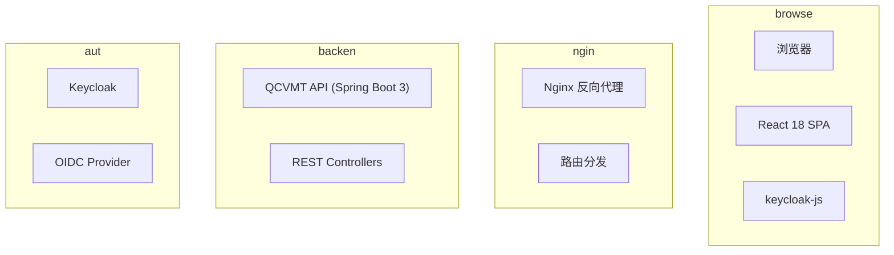
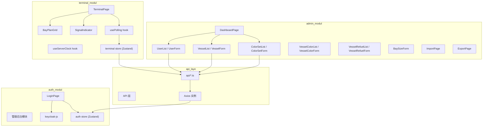
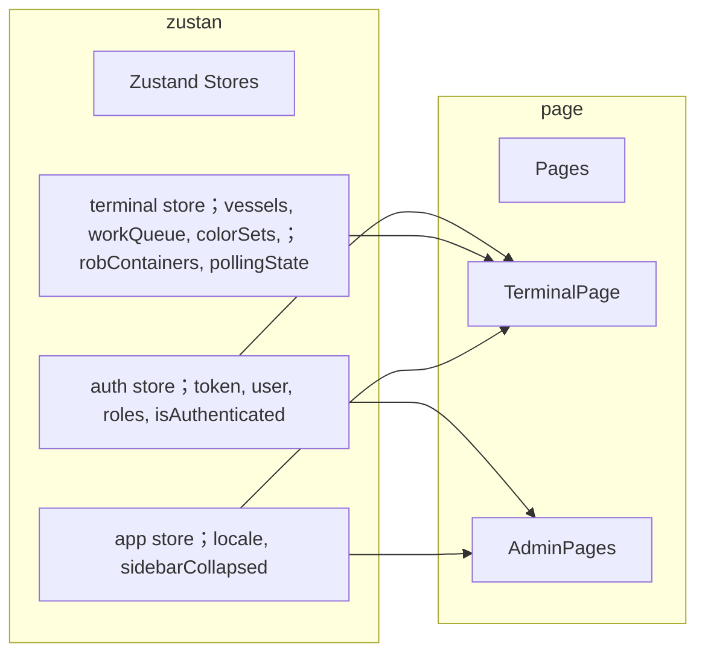
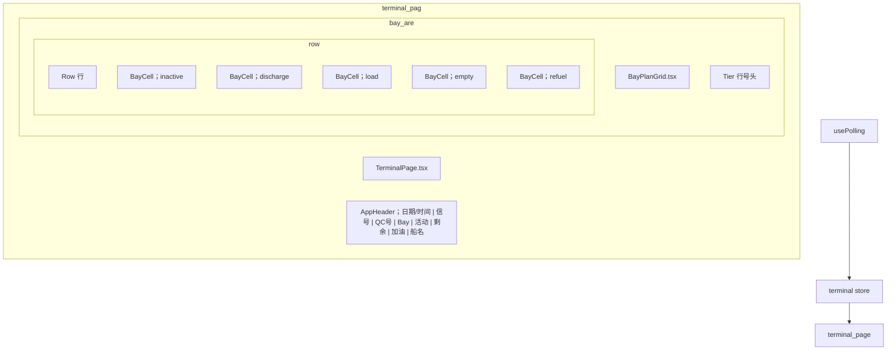
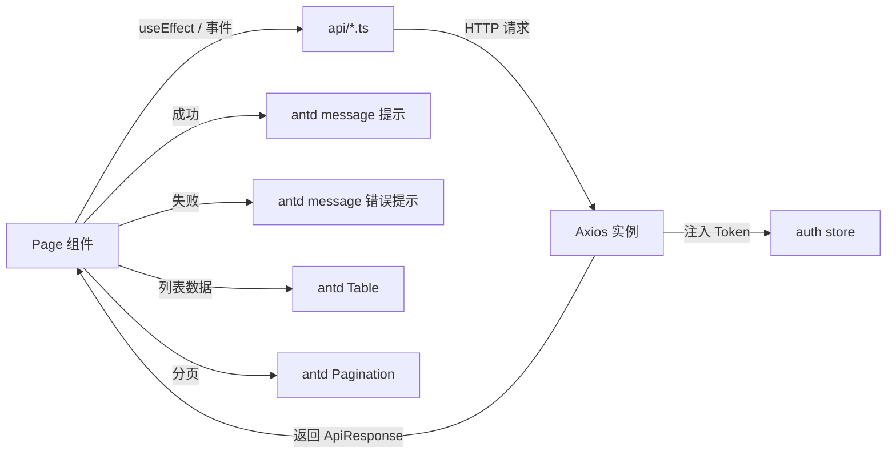
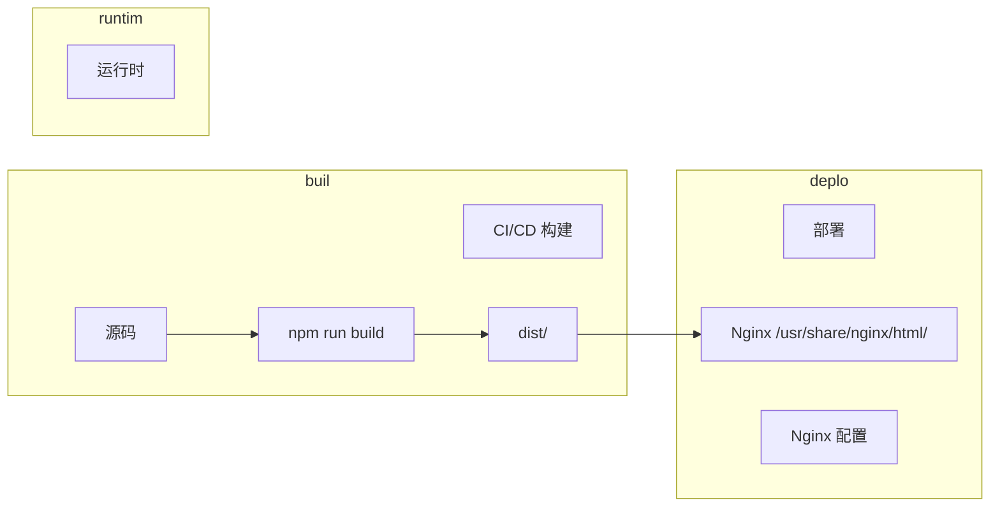

| 维度         | 现状                                             |
| ---------- | ---------------------------------------------- |
| 渲染方式       | JSP 服务端渲染（InternalResourceViewResolver）        |
| JS 框架      | 无（jQuery 1.11.1 + 原生 DOM 操作）                   |
| CSS        | 内联 `<style>` 每页重复 + 2 个外部 CSS 文件               |
| 构建工具       | 无（Maven 仅打包 WAR，无前端构建）                         |
| 认证         | HTTP Session + SecurityInterceptor             |
| 数据格式       | 自定义 XML-like 文本（非标准 XML、非 JSON）                |
| AJAX       | 仅 1 个端点（BusiQuery），jQuery $.ajax               |
| i18n       | Spring ResourceBundleMessageSource（3 种语言）      |
| 分页         | JSP Pager Taglib（服务端分页）                        |
| 浏览器兼容      | IE5+ (X-UA-Compatible, expression(), bgiframe) |
| 模块                                              | 页面                                                                                                                      | 功能                                                  |
| 认证                                              | `index.jsp`                                                                                                             | 入口重定向                                               |
| 认证                                              | `login.jsp`                                                                                                             | 用户登录（QC/HC/C 号 + 密码）                                |
| 认证                                              | `loginAdmin.jsp`                                                                                                        | 管理员登录                                               |
| 核心业务                                            | `tqcvmt.jsp`                                                                                                            | **QC Bay Plan 实时显示**（核心页面）                          |
| 管理                                              | `admin.jsp`                                                                                                             | 管理后台首页（用户列表 + 导航）                                   |
| 用户管理                                            | `userDetail.jsp`                                                                                                        | 创建用户                                                |
| 用户管理                                            | `update.jsp`                                                                                                            | 编辑用户                                                |
| 用户管理                                            | `log.jsp`                                                                                                               | 查看用户操作日志                                            |
| 配置                                              | `setbaysize.jsp`                                                                                                        | 设置 Bay 尺寸                                           |
| 颜色设置                                            | `colorManage.jsp`                                                                                                       | 颜色列表                                                |
| 颜色设置                                            | `colSetDetail.jsp`                                                                                                      | 添加颜色                                                |
| 颜色设置                                            | `updateColSet.jsp`                                                                                                      | 编辑颜色                                                |
| 船舶管理                                            | `vesselManage.jsp`                                                                                                      | 船舶配置列表                                              |
| 船舶管理                                            | `vesselDetail.jsp`                                                                                                      | 添加船舶                                                |
| 船舶管理                                            | `updateVessel.jsp`                                                                                                      | 编辑船舶                                                |
| 加油管理                                            | `vesselRefuelManage.jsp`                                                                                                | 加油状态列表                                              |
| 加油管理                                            | `vesselRefuelDetail.jsp`                                                                                                | 添加/编辑加油状态                                           |
| 贝位颜色                                            | `vesselColorManage.jsp`                                                                                                 | 贝位颜色配置列表                                            |
| 贝位颜色                                            | `vesselColorDetail.jsp`                                                                                                 | 添加/编辑贝位颜色                                           |
| 导入导出                                            | `importPage.jsp`                                                                                                        | 导入船舶数据                                              |
| 导入导出                                            | `exportPage.jsp`                                                                                                        | 导出日志                                                |
| 功能                                              | 代码位置                                                                                                                    | 迁移策略                                                |
| 自适应轮询（3 种模式）                                    | `getData()` L60-173                                                                                                     | **Refactor** → React hook `usePolling()`            |
| 服务器时间同步                                         | `setTime()`, `showTime()`, `calculateCurrentTime()`                                                                     | **Refactor** → `useServerClock()`                   |
| 信号指示灯                                           | `ChangeSignalIndicator()`                                                                                               | **Refactor** → React state                          |
| 自定义 XML 解析                                      | `getBaseContent()`, `getListContent()`, `getTimeContent()`                                                              | **Remove** → 改用 JSON API                            |
| Bay Plan HTML 注入                                | `setContent("tableList", tableInfo)`                                                                                    | **Rewrite** → React 组件数据驱动渲染                        |
| 数字校验                                            | `checkNumber()`                                                                                                         | **Refactor** → Zod schema 验证                        |
| 日期格式化                                           | `Date.prototype.format()`                                                                                               | **Remove** → dayjs                                  |
| #                                               | 问题                                                                                                                      | 影响                                                  |
| 严重度                                             |                                                                                                                         |                                                     |
| P1                                              | 服务端渲染 HTML 表格（Bay Plan 由后端生成 HTML 字符串注入）                                                                                | 前后端强耦合，无法独立部署                                       |
| 高                                               |                                                                                                                         |                                                     |
| P2                                              | 自定义 XML 响应格式（非标准，字符串截取解析）                                                                                               | 脆弱、不可维护                                             |
| 高                                               |                                                                                                                         |                                                     |
| P3                                              | CSS 大量重复（`# d1` 样式在 21 个 JSP 中各写一遍）                                                                                     |                                                     |
| 维护成本高                                           | 中                                                                                                                       |                                                     |
| P4                                              | IE5/IE6 兼容代码（`expression()`, `bgiframe`, `window.event`）                                                                | 无意义代码负担                                             |
| 低                                               |                                                                                                                         |                                                     |
| P5                                              | 无前端构建工具（JS/CSS 直接引用，手动版本号 `?v=4`）                                                                                       | 无法 tree-shake、压缩、版本管理                               |
| 中                                               |                                                                                                                         |                                                     |
| P6                                              | Session 认证（SecurityInterceptor + Session 存储 User）                                                                       | 无法前后端分离部署                                           |
| 高                                               |                                                                                                                         |                                                     |
| P7                                              | 表单验证逻辑重复（每个 JSP 内联相似 JS）                                                                                                | 维护成本高                                               |
| 中                                               |                                                                                                                         |                                                     |
| P8                                              | 硬编码管理员默认密码（admin/admin）                                                                                                 | 安全风险                                                |
| 高                                               |                                                                                                                         |                                                     |
| P9                                              | 无 TypeScript / 类型安全                                                                                                     | 运行时错误难排查                                            |
| 中                                               |                                                                                                                         |                                                     |
| P10                                             | 无自动化测试                                                                                                                  | 回归风险高                                               |
| 中                                               |                                                                                                                         |                                                     |
| 职责                                              | 前端 (React SPA)                                                                                                          | 后端 (Spring Boot 3)                                  |
| 页面渲染                                            | ✅ 完全负责                                                                                                                  | ❌                                                   |
| 路由管理                                            | ✅ React Router                                                                                                          | ❌                                                   |
| 表单验证                                            | ✅ 前端校验 + 后端校验                                                                                                           | ✅ 最终校验                                              |
| 认证                                              | ✅ keycloak-js 获取 Token                                                                                                  | ✅ JWT 验证                                            |
| 授权                                              | ✅ 路由守卫 + 按钮级控制                                                                                                          | ✅ @PreAuthorize                                     |
| Bay Plan 渲染                                     | ✅ 基于 JSON 数据渲染                                                                                                          | ❌ 只返回结构化数据                                          |
| 轮询控制                                            | ✅ 前端控制间隔和策略                                                                                                             | ❌                                                   |
| 业务规则校验                                          | ❌                                                                                                                       | ✅ 唯一权威                                              |
| 数据库操作                                           | ❌                                                                                                                       | ✅                                                   |
| N4 查询                                           | ❌                                                                                                                       | ✅                                                   |
| i18n                                            | ✅ 前端 i18n                                                                                                               | ✅ 后端错误消息 i18n                                       |
| 类别                                              | 选型                                                                                                                      | 理由                                                  |
| 框架                                              | **React 18**                                                                                                            | 生态成熟，社区庞大，Hooks 模型适合状态管理                            |
| 构建                                              | **Vite 5**                                                                                                              | 快速 HMR，原生 ESM，React 插件完善                            |
| 语言                                              | **TypeScript 5**                                                                                                        | 类型安全，API 响应类型化                                      |
| 路由                                              | **React Router 6**                                                                                                      | 官方路由，支持嵌套路由和 loader                                 |
| 状态管理                                            | **Zustand**                                                                                                             | 轻量、无 boilerplate、TypeScript 友好                      |
| HTTP 客户端                                        | **Axios**                                                                                                               | 拦截器、Token 注入、错误处理                                   |
| 认证                                              | **keycloak-js**                                                                                                         | Keycloak 官方 JS 适配器                                  |
| UI 组件库                                          | **Ant Design 5**                                                                                                        | 表格/表单/分页/对话框成熟，企业级管理后台首选                            |
| i18n                                            | **react-i18next**                                                                                                       | React 生态最成熟的 i18n 方案                                |
| 表单                                              | **React Hook Form + Zod**                                                                                               | 高性能表单 + 类型安全 schema 验证                              |
| 日期处理                                            | **dayjs**                                                                                                               | 轻量，替代旧 `Date.prototype.format`                      |
| CSS 方案                                          | **Ant Design 主题 + CSS Modules**                                                                                         | 统一设计系统 + 样式隔离                                       |
| 代码规范                                            | **ESLint + Prettier**                                                                                                   | 统一代码风格                                              |
| 测试                                              | **Vitest + React Testing Library**                                                                                      | 单元测试 + 组件测试                                         |
| 旧 URL                                           | 新 REST API                                                                                                              | 方法                                                  |
| `BusiQuery.html?qcNum=xxx`                      | `GET /api/terminal/query?qcNum=xxx`                                                                                     | JSON                                                |
| `all.html`                                      | `GET /api/users?page=0&size=10`                                                                                         | JSON                                                |
| `save.html` (POST)                              | `POST /api/users`                                                                                                       | JSON                                                |
| `update.html` (POST)                            | `PUT /api/users/{id}`                                                                                                   | JSON                                                |
| `del.html?id=x`                                 | `DELETE /api/users/{id}`                                                                                                | JSON                                                |
| `log.html?id=x`                                 | `GET /api/users/{id}/logs`                                                                                              | JSON                                                |
| `allVessel.html`                                | `GET /api/vessels`                                                                                                      | JSON                                                |
| `saveVessel.html`                               | `POST /api/vessels`                                                                                                     | JSON                                                |
| `updateVessel.html`                             | `PUT /api/vessels/{id}`                                                                                                 | JSON                                                |
| `delVessel.html?id=x`                           | `DELETE /api/vessels/{id}`                                                                                              | JSON                                                |
| `searchVessel.html?key=x`                       | `GET /api/vessels?keyword=x`                                                                                            | JSON                                                |
| `allColSet.html`                                | `GET /api/color-sets`                                                                                                   | JSON                                                |
| `saveColSet.html`                               | `POST /api/color-sets`                                                                                                  | JSON                                                |
| `updateColSet.html`                             | `PUT /api/color-sets/{id}`                                                                                              | JSON                                                |
| `allVesselCol.html`                             | `GET /api/vessel-colors`                                                                                                | JSON                                                |
| `saveVesselCol.html`                            | `POST /api/vessel-colors`                                                                                               | JSON                                                |
| `delVesselCol.html?id=x`                        | `DELETE /api/vessel-colors/{id}`                                                                                        | JSON                                                |
| `allVesselRefuel.html`                          | `GET /api/vessel-refuels`                                                                                               | JSON                                                |
| `updateVesselRefuelStatus.html`                 | `POST /api/vessel-refuels`                                                                                              | JSON                                                |
| `delVesselRefuel.html?id=x`                     | `DELETE /api/vessel-refuels/{id}`                                                                                       | JSON                                                |
| `setbay.html`                                   | `GET /api/bay-config`                                                                                                   | JSON                                                |
| `updateBay.html`                                | `PUT /api/bay-config`                                                                                                   | JSON                                                |
| `importVessel.html`                             | `POST /api/import/vessel`                                                                                               | multipart                                           |
| `exportLogs.html`                               | `GET /api/export/logs?from=x&to=y`                                                                                      | file download                                       |
| 路由                                              | qcvmt-admin                                                                                                             | qcvmt-user                                          |
| `/terminal`                                     | ✅                                                                                                                       |                                                     |
| `/admin`                                        | ✅                                                                                                                       | ❌                                                   |
| `/admin/users/**`                               | ✅                                                                                                                       | ❌                                                   |
| `/admin/vessels/**`                             | ✅                                                                                                                       | ❌                                                   |
| `/admin/color-sets/**`                          | ✅                                                                                                                       | ❌                                                   |
| `/admin/vessel-refuels/**`                      | ✅                                                                                                                       | ✅（受限账户）                                             |
| `/admin/vessel-colors/**`                       | ✅（受限账户）                                                                                                                 |                                                     |
| `/admin/bay-config`                             | ✅                                                                                                                       | ❌                                                   |
| `/admin/import`                                 | ✅                                                                                                                       | ❌                                                   |
| `/admin/export`                                 | ✅                                                                                                                       | ❌                                                   |
| CSS 类                                           | 条件                                                                                                                      | 样式                                                  |
| `.inactive`                                     | 非活跃位置                                                                                                                   | 背景色 = ColSet 中 `inactive` 颜色                        |
| `.unable`                                       | 禁用位置                                                                                                                    | 背景色 = ColSet 中 `unable` 颜色                          |
| `.empty`                                        | 空位                                                                                                                      | 背景色 = ColSet 中 `empty` 颜色                           |
| `.discharge`                                    | 卸箱                                                                                                                      | 背景色 = ColSet 中 `discharge` 颜色                       |
| `.load`                                         | 装箱                                                                                                                      | 背景色 = ColSet 中 `load` 颜色                            |
| `.complexunit`                                  | 连体箱                                                                                                                     | 背景色 = ColSet 中 `complexunit` 颜色                     |
| `.twenty`                                       | 20ft 箱                                                                                                                  | 红色文字 + inactive 背景                                  |
| `.refuel`                                       | 加油区域                                                                                                                    | 红色背景 + 红色文字                                         |
| `span.dgind`                                    | 危险品标识                                                                                                                   | 黄色背景 + 红色文字，绝对定位右上角                                 |
| 层级                                              | 处理方式                                                                                                                    |                                                     |
| **Axios 拦截器**                                   | 401 → 重新登录；403 → 权限不足提示；50 → 通用错误提示                                                                                     |                                                     |
| **API 层**                                       | 解析 `ApiResponse.code`，非 200 抛出 `BusinessError`                                                                          |                                                     |
| **Hook 层**                                      | catch 后设置 `signalStatus = 'red'` 或 `error` 状态                                                                           |                                                     |
| **组件层**                                         | `error` state → 显示 `Result` 组件；`message.error(msg)` 提示                                                                  |                                                     |
| 状态                                              | 组件                                                                                                                      | 实现                                                  |
| 加载中                                             | `Spin` (Ant Design)                                                                                                     | 列表页、表单提交时                                           |
| 空数据                                             | `Empty`                                                                                                                 | 列表无数据时                                              |
| 错误                                              | `Result` + 重试按钮                                                                                                         | API 调用失败时                                           |
| 骨架屏                                             | `Skeleton`                                                                                                              | 首次加载 Terminal 页                                     |
| 信号指示                                            | `SignalIndicator` 组件                                                                                                    | 绿/红 GIF 图标（保留旧项目设计）                                 |
| 指标                                              | 目标值                                                                                                                     | 措施                                                  |
| 首次加载 (FCP)                                      | < 2s                                                                                                                    | 路由懒加载（`React.lazy`）、代码分割                            |
| Bay Plan 渲染                                     | < 200ms                                                                                                                 | `React.memo` 跳过未变化单元格、CSS 动画避免                      |
| 轮询开销                                            | 最小化                                                                                                                     | 自适应间隔（迁移旧逻辑）                                        |
| Bundle 大小                                       | < 300KB gzip                                                                                                            | Ant Design 按需导入、tree-shaking                        |
| 策略                                              | 实现                                                                                                                      |                                                     |
| 路由懒加载                                           | 所有 page 使用 `React.lazy` + `Suspense`                                                                                    |                                                     |
| 组件按需导入                                          | Ant Design 5 原生支持 tree-shaking                                                                                          |                                                     |
| BayCell 优化                                      | `React.memo` 避免未变化单元格重渲染                                                                                                |                                                     |
| 图片优化                                            | green.gif / red.gif 转为 SVG 内联（可选）                                                                                       |                                                     |
| 轮询优化                                            | 保留自适应退避策略，`useRef` 管理定时器避免闭包问题                                                                                          |                                                     |
| HTTP 缓存                                         | 静态资源配置 long-term cache + hash 文件名                                                                                       |                                                     |
| 层级                                              | 工具                                                                                                                      | 覆盖目标                                                |
| 优先级                                             |                                                                                                                         |                                                     |
| 单元测试                                            | Vitest                                                                                                                  | hooks（usePolling, useServerClock）、validators、api 模块 |
| 高                                               |                                                                                                                         |                                                     |
| 组件测试                                            | React Testing Library                                                                                                   | BayPlanGrid、BayCell、表单组件                            |
| 高                                               |                                                                                                                         |                                                     |
| E2E 测试                                          | Playwright（可选）                                                                                                          | 登录流程、核心页面导航                                         |
| 中                                               |                                                                                                                         |                                                     |
| 场景                                              | 测试内容                                                                                                                    |                                                     |
| 自适应轮询                                           | 连续超时 → 间隔递增；成功 → 间隔恢复                                                                                                   |                                                     |
| Bay Plan 渲染                                     | 给定 SequenceVO 数组 → 正确渲染 CSS 类                                                                                           |                                                     |
| 表单验证                                            | vesselColorDetail 的奇偶校验、tierStart/tierEnd 联动校验                                                                          |                                                     |
| Token 过期                                        | 401 响应 → 触发重新登录                                                                                                         |                                                     |
| 权限控制                                            | 非 admin 用户 → 无法访问管理页面                                                                                                   |                                                     |
| 维度                                              | 实现                                                                                                                      |                                                     |
| 前端错误上报                                          | `window.onerror` + React `ErrorBoundary` → `console.error`（Phase 1），后续可接入 Sentry                                        |                                                     |
| API 请求日志                                        | Axios 拦截器记录请求/响应（开发环境）                                                                                                  |                                                     |
| 轮询状态                                            | `usePolling` 记录每次轮询结果、间隔变化、超时次数                                                                                         |                                                     |
| 用户操作                                            | 后端 OperationLog（已有），前端不额外记录                                                                                             |                                                     |
| 健康检查                                            | 后端 `/actuator/health`，前端可通过信号指示判断                                                                                       |                                                     |
| Current (旧项目)                                   | Target (新项目)                                                                                                            | Action                                              |
| `index.jsp` (重定向)                               | `router` 默认路由 + `AuthGuard`                                                                                             | **Rewrite**                                         |
| `login.jsp` (QC/HC/C 输入 + 密码)                   | `LoginPage.tsx` + Keycloak OIDC                                                                                         | **Rewrite**                                         |
| `loginAdmin.jsp`                                | 移除（Keycloak 统一登录）                                                                                                       | **Remove**                                          |
| `tqcvmt.jsp` (核心 Bay Plan)                      | `TerminalPage.tsx` + `BayPlanGrid.tsx` + `BayCell.tsx`                                                                  | **Rewrite**                                         |
| `vmt.js` (轮询 + XML 解析)                          | `hooks/usePolling.ts` + `hooks/useServerClock.ts`                                                                       | **Refactor**                                        |
| `vmt.js` → `checkNumber()`                      | `src/utils/validators.ts` (Zod)                                                                                         | **Refactor**                                        |
| `vmt.js` → `Date dayjs                          | **Remove**                                                                                                              |                                                     |
| `vmt.js` → XML 解析函数                             | 移除（改用 JSON API）                                                                                                         | **Remove**                                          |
| `vmt.js` → 信号指示                                 | `SignalIndicator.tsx`                                                                                                   | **Refactor**                                        |
| `admin.jsp` (用户列表 + 导航)                         | `DashboardPage.tsx` + `UserList.tsx`                                                                                    | **Rewrite**                                         |
| `userDetail.jsp` (创建用户)                         | `UserForm.tsx`                                                                                                          | **Rewrite**                                         |
| `update.jsp` (编辑用户)                             | `UserForm.tsx`（复用）                                                                                                      | **Rewrite**                                         |
| `log.jsp` (操作日志)                                | `UserLogs.tsx`                                                                                                          | **Rewrite**                                         |
| `setbaysize.jsp`                                | `BaySizeForm.tsx`                                                                                                       | **Rewrite**                                         |
| `colorManage.jsp`                               | `ColorSetList.tsx`                                                                                                      | **Rewrite**                                         |
| `colSetDetail.jsp`                              | `ColorSetForm.tsx`                                                                                                      | **Rewrite**                                         |
| `updateColSet.jsp`                              | `ColorSetForm.tsx`（复用）                                                                                                  | **Rewrite**                                         |
| `vesselManage.jsp`                              | `VesselList.tsx`                                                                                                        | **Rewrite**                                         |
| `vesselDetail.jsp`                              | `VesselForm.tsx`                                                                                                        | **Rewrite**                                         |
| `updateVessel.jsp`                              | `VesselForm.tsx`（复用）                                                                                                    | **Rewrite**                                         |
| `vesselRefuelManage.jsp`                        | `VesselRefuelList.tsx`                                                                                                  | **Rewrite**                                         |
| `vesselRefuelDetail.jsp`                        | `VesselRefuelForm.tsx`                                                                                                  | **Rewrite**                                         |
| `vesselColorManage.jsp`                         | `VesselColorList.tsx`                                                                                                   | **Rewrite**                                         |
| `vesselColorDetail.jsp`                         | `VesselColorForm.tsx`                                                                                                   | **Rewrite**                                         |
| `importPage.jsp`                                | `ImportPage.tsx`                                                                                                        | **Rewrite**                                         |
| `exportPage.jsp`                                | `ExportPage.tsx`                                                                                                        | **Rewrite**                                         |
| `box.css`                                       | `src/styles/global.css` + `bay-plan.module.css`                                                                         | **Refactor**                                        |
| `colorPickerStyle.css`                          | Ant Design `ColorPicker` 组件                                                                                             | **Remove**                                          |
| `jquery.soColorPicker-1.0.js`                   | Ant Design `ColorPicker`                                                                                                | **Remove**                                          |
| `jquery.bgiframe-2.1.2.js`                      | 移除（IE6 修复）                                                                                                              | **Remove**                                          |
| `jquery-1.11.1.min.js`                          | 移除（React 替代）                                                                                                            | **Remove**                                          |
| `green.gif` / `red.gif`                         | `src/assets/images/` 保留或转 SVG                                                                                           | **Keep**                                            |
| `logout.jpg` / `QClogout.gif`                   | Ant Design 图标替代                                                                                                         | **Remove**                                          |
| `messages_en.properties`                        | `src/locales/en.json`                                                                                                   | **Move**                                            |
| `messages_zh_TW.properties`                     | `src/locales/zh-TW.json`                                                                                                | **Move**                                            |
| `messages_zh_CN.properties`                     | `src/locales/zh-CN.json`                                                                                                | **Move**                                            |
| `system.properties`                             | 后端 application.yml（已有）                                                                                                  | **Remove**                                          |
| `springMVC-servlet.xml`                         | 移除（Spring Boot 配置替代）                                                                                                    | **Remove**                                          |
| `web.xml`                                       | 移除（Spring Boot 内嵌 Tomcat）                                                                                               | **Remove**                                          |
| JSP 内联 `<style>` (# d1 重复 21 次)                 |                                                                                                                         |                                                     |
| `AdminLayout.tsx` 统一布局                          | **Refactor**                                                                                                            |                                                     |
| JSP 内联 `sh()` 函数（21 处重复）                        | `usePermission.ts` + `ConfirmDialog.tsx`                                                                                |                                                     |
| **Refactor**                                    |                                                                                                                         |                                                     |
| `` 分页标签                                         | Ant Design `Pagination`                                                                                                 |                                                     |
| **Rewrite**                                     |                                                                                                                         |                                                     |
| IE `expression()` CSS                           | 移除                                                                                                                      |                                                     |
| **Remove**                                      |                                                                                                                         |                                                     |
| 维度                                              | 说明                                                                                                                      |                                                     |
| **Goal**                                        | 搭建 React 18 + Vite + TypeScript 项目骨架                                                                                    |                                                     |
| **Main Changes**                                | 初始化项目、配置 ESLint/Prettier、安装依赖、配置 Vite proxy、配置环境变量                                                                      |                                                     |
| **Affected Modules**                            | 无（纯基础设施）                                                                                                                |                                                     |
| **Dependencies**                                | 无                                                                                                                       |                                                     |
| **Risks**                                       | 低                                                                                                                       |                                                     |
| **Verification**                                | `npm run dev` 启动成功，`npm run build` 构建成功                                                                                 |                                                     |
| **Definition of Done**                          | 项目可启动，显示空白 App.tsx，Vite proxy 配置正确                                                                                      |                                                     |
| **Goal**                                        | 建立完整的 API 层和类型定义                                                                                                        |                                                     |
| **Main Changes**                                | 创建 Axios 实例、拦截器、所有 API 模块、TypeScript 类型                                                                                 |                                                     |
| ** `src/api/`, `src/types/`, `src/lib/axios.ts` |                                                                                                                         |                                                     |
| **Dependencies**                                | Phase 1                                                                                                                 |                                                     |
| **Risks**                                       | 低（需后端 API 已就绪）                                                                                                          |                                                     |
| **Verification**                                | 单元测试通过，API 调用可正确发送请求                                                                                                    |                                                     |
| **Definition of Done**                          | 所有 9 个 API 模块完成，类型定义完整，Axios 拦截器工作正常                                                                                    |                                                     |
| **Goal**                                        | 完成认证、路由、i18n、布局组件                                                                                                       |                                                     |
| **Main Changes**                                | Keycloak 集成、React Router 配置、i18n 迁移、布局组件                                                                                |                                                     |
|                                                 | `src/lib/keycloak.ts`, `src/router/`, `src/lib/i18n.ts`, `src/stores/auth.ts`, `src/components/layout/`, `src/locales/` |                                                     |
| **Dependencies**                                | Phase 1, Phase 2                                                                                                        |                                                     |
| **Risks**                                       | 中（Keycloak 配置需与后端一致）                                                                                                    |                                                     |
| **Verification**                                | 可完成 Keycloak 登录流程，路由守卫正常工作，i18n 切换正常                                                                                    |                                                     |
| **Definition of Done**                          | 登录 → Token 获取 → 路由跳转 → 布局渲染 完整链路通过                                                                                      |                                                     |
| **Goal**                                        | 完成 QC 终端页（核心页面）和管理后台首页                                                                                                  |                                                     |
| **Main Changes**                                | TerminalPage + BayPlanGrid + 自适应轮询 + DashboardPage                                                                      |                                                     |
| ** 1-3                                          |                                                                                                                         |                                                     |
| **Risks**|**高**（核心业务页面，Bay Plan 渲染逻辑复杂）                                                                                           |                                                     |
| **Verification**                                | Bay Plan 正确渲染，轮询正常工作，信号指示正确                                                                                             |                                                     |
| **Definition of Done**                          | TerminalPage 可正确显示 Bay Plan，轮询间隔自适应，信号指示绿/红切换                                                                           |                                                     |
| **Goal**                                        | 完成所有管理后台子页面                                                                                                             |                                                     |
| **Main Changes**                                | 用户管理、船舶管理、颜色设置、加油管理、贝位颜色、Bay 尺寸、导入导出                                                                                    |                                                     |
| **Dependencies**                                | Phase 1-4                                                                                                               |                                                     |
| **Risks**                                       | 低（CRUD 页面模式统一）                                                                                                          |                                                     |
| **Verification**                                | 每个模块 CRUD 操作完整可用                                                                                                        |                                                     |
| **Definition of Done**                          | 所有管理后台页面可正常增删改查，表单验证正确，分页正常                                                                                             |                                                     |
| **Goal**                                        | 确认新前端完全替代旧 JSP，清理旧代码                                                                                                    |                                                     |
| **Main Changes**                                | 从后端项目中移除 JSP 相关文件、移除 web.xml、springMVC-servlet.xml                                                                      |                                                     |
| **Affected Modules**                            | 后端项目中的 `src/main/webapp/` 目录 / ```                                                                                      |                                                     |
`````text
| ** 1-5 全部完成并验证 |  |
| --- | --- |
| ```
```` |  |
| **Risks** | 中（需确保无遗漏功能） |
| --- | --- |
| **Verification** | 功能对比测试：旧系统 vs 新系统，所有功能点一一对应 |
| **Definition of Done** | 旧 `webapp/` 目录完全移除，后端不再依赖 JSP 视图解析器 |
| **Goal** | 完成前端 Docker 镜像构建和 Nginx 配置 |
| **Main Changes** | Dockerfile、nginx.conf、CI/CD pipeline / ```
`````
`| ** 部署配置 |`
````text
``` |
| **Dependencies** | Phase 1-6 |
| --- | --- |
| **Verification** | Docker 镜像构建成功，Nginx 代理正确，前端可独立访问后端 API |
| **Definition of Done** | 前端 Docker 镜像可部署，Nginx 正确代理 `/api/*` 到后端 |
| # | 风险 | 影响 | 概率 | 缓解措施 |
| R1 | Bay Plan 渲染逻辑复杂，服务端生成 HTML 转前端数据驱动可能遗漏边界情况 | 高 | 中 | 对比旧系统截图逐一验证；保留旧系统并行运行一段时间 |
| R2 | 自适应轮询逻辑迁移后行为不一致 | 中 | 低 | 编写完整单元测试覆盖所有模式（Mode 1/2/3） |
| R3 | Keycloak 配置与后端不一致导致认证失败 | 高 | 低 | 前后端联调阶段重点验证；开发环境使用独立 realm |
| R4 | N4 Oracle 查询超时导致前端长时间等待 | 中 | Axios timeout 设置 + 轮询超时处理 + 信号指示红灯 |  |
| R5 | 旧系统用户习惯改变（如键盘快捷键 Numpad +/-） | 低 | 高 | 在新系统中保留关键快捷键（可在 Phase 5 后追加） |
| R6 | i18n 翻译 key 迁移遗漏 | 低 | 低 | 自动化脚本对比 properties 和 json 文件的 key 完整性 |
| # | 问题 | 影响范围 | 建议 |  |
| OQ1 | 旧系统键盘快捷键（Numpad +/- 切换焦点、Numpad * 登出）是否需要保留？ | TerminalPage | 建议 Phase 5 后根据用户反馈决定 |  |
| OQ2 | `limitAccount`（受限账户）逻辑是否需要迁移到 Keycloak role 还是保持后端配置？ | 权限控制 | 建议迁移为 Keycloak 自定义属性 |  |
| OQ3 | Cookie 持久化 QC/HC/C 号的功能在 Keycloak 登录后是否还需要？ | 登录流程 | Keycloak 登录后通过 API 获取，不再需要 Cookie |  |
| OQ4 | Bay Plan 是否需要支持缩放/响应式？当前为固定尺寸 | TerminalPage | 建议保持固定尺寸（工控屏分辨率固定） |  |
| OQ5 | 旧系统 `loadTimeCount`（LOAD 完成后继续显示 N 个刷新周期）逻辑是否在后端还是前端实现？ | 轮询逻辑 | 建议前端实现，后端在 WorkQueueResult 中标记状态 |  |
| OQ6 | 是否需要保留 debug 模式（显示原始响应数据）？ | 开发调试 | 建议仅在开发环境保留 | / 好的，以下是基于 **React 技术栈** 重新设计的完整 Frontend Technical Design。 / &nbsp; |
# Frontend Technical Design — QCVMT
## 1. Executive Summary
本文档描述 QCVMT（QC Vessel Management Tool）前端从 JSP + jQuery 服务端渲染架构向 **React 18 SPA + REST API** 前后端分离架构的渐进式改造方案。
核心改造范围：
- 将 21 个 JSP 页面重写为 React 组件
- 将唯一 AJAX 端点（BusiQuery，自定义 XML 格式）迁移为标准 REST JSON API
- 将 Session 认证替换为 Keycloak OIDC
- 保留并重构核心业务逻辑（自适应轮询、Bay Plan 渲染、表单验证）
- 删除所有 IE 兼容代码和 JSP 模板
## 2. Background
QCVMT 是 Modern Terminals 码头岸桥（QC）作业可视化管理系统，核心功能：
- **实时 Bay Plan 显示**：通过轮询从 N4 TOS 获取作业队列，渲染船舶贝位图
- **管理后台**：船舶配置、颜色设置、加油状态、用户管理、日志导出等
当前系统基于 Spring MVC 3.0.1 + JSP + jQuery 1.11.1，Java 1.7，部署为 WAR 包。后端已设计完成 Spring Boot 3 + REST API 改造方案，前端需同步改造。
## 3. Current State
### 3.1 技术栈
### 3.2 页面清单（21 个 JSP）
### 3.3 核心 JS 分析（vmt.js — 366 行）
## 4. Existing Problems
## 5. Goals
1. 实现前后端完全分离，前端可独立构建、部署
2. 前端通过 REST JSON API 与后端交互，不再依赖服务端渲染
3. 认证由 Keycloak OIDC 接管，前端使用 `keycloak-js`
4. Bay Plan 由前端基于 JSON 数据自行渲染（数据驱动）
5. 保留并优化自适应轮询机制
6. 支持 3 种语言（EN / 繁体中文 / 简体中文）
7. 消除所有 IE 兼容代码
## 6. Non-Goals
- 不重新设计后端 API（已有 Backend Technical Design）
- 不改变业务逻辑（Bay Plan 渲染规则、轮询策略保持不变）
- 不引入移动端适配（系统仅在码头工控屏/PC 使用）
- 不引入 SSR / SSG（纯 SPA 即可满足需求）
- 不引入微前端（项目规模不需要）
## 7. Target Architecture
```mermaid
```
```mermaid
```

```
```
```
end
spa -->|"静态资源"| nginx
spa -->|"/api/* 代理"| nginx
nginx -->|"/api/*"| api
nginx -->|"/ 静态文件"| spa
kc_js -->|"OIDC 登录/刷新 Token"| kc
api -->|"Bearer Token 验证"| kc
```
```
````
`````text
<pre data-tdlc-diagram="1" style="white-space:pre;overflow-x:auto;font-family:ui-monospace,SFMono-Regular,Menlo,Monaco,Consolas,monospace;font-size:13px;line-height:1.5;margin:0.5em 0">
&lt;pre data-tdlc-diagram="1" style="white-space:pre;overflow-x:auto;font-family:ui-monospace,SFMono-Regular,Menlo,Monaco,Consolas,monospace;font-size:13px;line-height:1.5;margin:0.5em 0"&gt;
### 7.1 前后端职责
## 8. Technology Stack
## 9. Project Structure
`qcvmt-frontend/`\
`├── index.html`\
`├── vite.config.ts`\
`├── tsconfig.json`\
`├── package.json`\
`├── .env                          # VITE_API_BASE_URL, VITE_KEYCLOAK_URL 等`\
`├── .env.development`\
`├── .env.production`\
`├── public/`\
`│   ├── favicon.ico`\
`│  └── silent-check-sso.html     # Keycloak 静默 SO 检查`\
`└── src/`\
`├── main.tsx                  # 入口：初始化 Keycloak、i18n、渲染 App`\&lt;/pre&gt;</pre>
```
```
`├── App.tsx                   # 根组件：路由 + 布局`\
`├── vite-env.d.ts             # 环境变量类型`\
`│`\
`├── assets/                   # 静态资源`\
`│   └── images/`\
`│       ├── green.gif         # ← 保留自旧项目`\
`│       └── red.gif           # ← 保留自旧项目`\
`│`\
`├── lib/                     # 第三方库初始化`\
`│   ├── keycloak.ts           # Keycloak 实例创建与初始化`\
`│   ├── axios.ts              # Axios 实例 + 拦截器`\
`│  └── i18n.ts              # i18next 配置`\
`│`\
`├── router/`\
`│  └── index.tsx             # 路由定义 + AuthGuard 组件`\
`│`\
`├── stores/                   # Zustand stores`\
`│   ├── auth.ts               # 用户认证状态、Token、角色`\
`│   ├── terminal.ts           # Bay Plan 实时数据状态`\
`│   └── app.ts                # 全局 UI 状态（语言、侧边栏等）`\
`│`\
`├── api/                      # API 层（按业务模块）`\
`│  ├── types.ts             # API 通用类型（ApiResponse, PageResponse）`\
`│   ├── user.ts               # /api/users`\
`│   ├── vessel.ts             # /api/vessels`\
`│   ├── colorSet.ts           # /api/color-sets`\
`│  ├── vesselColor.ts        # /api/vessel-colors`\
`│  ├── vesselRefuel.ts       # /api/vessel-refuels`\
`│   ├── bayConfig.ts          # /api/bay-config`\
`│  ├── terminal.ts          # /api/terminal`\
`│   ├── operationLog.ts       # /api/operation-logs`\
`│   └── importExport.ts       # /api/import, /api/export`\
`│`\
`├── hooks/                    # 自定义 Hooks`\
`│   ├── usePolling.ts        # 自适应轮询（迁移自 vmt.js）`\
`│  ├── useServerClock.ts     # 服务器时间同步`\
`│  └── usePermission.ts      # 权限判断`\
`│`\
`├── pages/                   # 页面级组件`\
`│   ├── login/`\
`│   └── LoginPage.tsx     # 登录页（Keycloak 重定向）`\
`│  ├── terminal/`\
`│   │   └── TerminalPage.tsx  # QC Bay Plan 实时显示`\
`│  ├── admin/`\
`│   │   ├── DashboardPage.tsx # 管理后台首页`\
`│   ├── UserList.tsx      # 用户列表`\
`│   ├── UserForm.tsx     # 创建/编辑用户`\
`│   │  └── UserLogs.tsx     # 用户操作日志`\
`│   ├── vessel/`\
`│   ├── VesselList.tsx    # 船舶配置列表`\
`│   │  └── VesselForm.tsx    # 创建/编辑船舶`\
`│   ├── color/`\
`│   │  ├── ColorSetList.tsx  # 颜色设置列表`\
`│   └── ColorSetForm.tsx  # 创建/编辑颜色`\
`│   ├── vesselColor/`\
`│   ├── VesselColorList.tsx`\
`│   │  └── VesselColorForm.tsx`\
`│   ├── vesselRefuel/`\
`│   │  ├── VesselRefuelList.tsx`\
`│   └── VesselRefuelForm.tsx`\
`│  ├── bayConfig/`\
`│   └── BaySizeForm.tsx   # Bay 尺寸配置`\
`│  └── importExport/`\
`│       ├── ImportPage.tsx   # 导入船舶`\
`│      └── ExportPage.tsx   # 导出日志`\
`│`\
`├── components/               # 可复用组件`\
`│   ├── layout/`\
`│   ├── AppHeader.tsx     # 顶部栏（MODERN TERMINALS 品牌）`\
`│   ├── AdminLayout.tsx   # 管理后台布局`\
`│   │  └── TerminalLayout.tsx # QC 操作页全屏布局`\
`│   ├── bay/`\
`│   ├── BayPlanGrid.tsx   # Bay Plan 网格渲染（核心组件）`\
`│   ├── BayCell.tsx      # 单个贝位单元格`\
`│   │  └── SignalIndicator.tsx # 信号指示灯`\
`│   ├── common/`\
`│   │  ├── ConfirmDialog.tsx # 确认对话框`\
`│   ├── SearchBar.tsx     # 搜索栏`\
`│  └── AuthGuard.tsx    # 路由守卫组件`\
`│   └── color/`\
`│       └── ColorPicker.tsx   # 颜色选择器（替代 soColorPicker）`\
`│`\
`├── types/                    # 全局 TypeScript 类型`\
`│  ├── user.ts`\
`│   ├── vessel.ts`\
`│   ├── colorSet.ts`\
`│   ├── terminal.ts           # TerminalView, WorkQueueResult, SequenceVO`\
`│  └── bayConfig.ts`\
`│`\
`├── locales/                  # i18n 翻译文件`\
`│   ├── en.json               # ← 迁移自 messages_en.properties`\
`│   ├── zh-TW.json            # ← 迁移自 messages_zh_TW.properties`\
`│  └── zh-CN.json            # ← 迁移自 messages_zh_CN.properties`\
`│`\
`├── utils/`\
`│  ├── validators.ts        # Zod schemas（迁移自各 JSP 内联 JS）`\
`│   └── format.ts             # 格式化工具`\
`│`\
`└── styles/`\
`├── theme.ts              # Ant Design 主题 token`\
`├── bay-plan.module.css   # Bay Plan 样式（迁移自 tqcvmt.jsp 内联 CSS）`\
`└── global.css           # 全局样式`
```
```
```
```
## 10. Module Design
### 10.1 模块总览mermaid
```mermaid
```
```mermaid
```

```
```
```
<pre data-tdlc-diagram="1" style="white-space:pre;overflow-x:auto;font-family:ui-monospace,SFMono-Regular,Menlo,Monaco,Consolas,monospace;font-size:13px;line-height:1.5;margin:0.5em 0">### 10.2 各模块详细说明
### 认证模块
**Current**: `login.jsp` / `loginAdmin.jsp` → Session 认证 → SecurityInterceptor **Proposed**: keycloak-js 标准 OIDC 流程
- 用户访问任何页面 → `AuthGuard` 检测未认证 → 调用 `keycloak.login()` 重定向到 Keycloak 登录页
- 登录成功 → 获取 Access Token + Refresh Token → 存储到 Zustand auth store
- API 请求自动注入 `Authorization: Bearer &lt;token&gt;`
- Token 过期 → keycloak-js 静默刷新（`checkLoginIframe` + `init({ onLoad: 'check-so' })`）
- **移除**：QC/HC/C 号输入（改为登录后从 API 获取当前用户信息）
### QC 终端模块（核心）
**Current**: `tqcvmt.jsp` + `vmt.js` → AJAX GET `BusiQuery.html` → 自定义 XML → 服务端生成 HTML 表格 → innerHTML 注入 **Proposed**: React 组件数据驱动渲染
- `TerminalPage.tsx`：页面容器，协调子组件
- `BayPlanGrid.tsx`：接收 `TerminalView` JSON 数据，渲染 Bay 位网格
- `BayCell.tsx`：单个单元格，使用 `React.memo` 优化，根据 `SequenceVO` 属性决定样式
- `SignalIndicator.tsx`：绿/红信号指示
- `usePolling()` hook：迁移自适应轮询逻辑，使用 `useRef` + `useCallback` 管理定时器
- `useServerClock()` hook：服务器时间同步
### 管理后台模块
**Current**: 多个 JSP 页面，服务端渲染列表 + 表单 **Proposed**: React 页面 + Ant Design 组件
- 列表页：`Table` + `Pagination` + `Input.Search`
- 表单页：`Form` + React Hook Form + Zod schema
- 对话框：`Modal.confirm`（确认删除）
- 导入：`Upload`（文件上传）
- 导出：`DatePicker.RangePicker` + 触发文件下载
## 11. API Layer
### 11.1 Axios 实例配置</pre>typescript
// src/lib/axios.ts
import axios from 'axios'
import keycloak from './keycloak'
const apiClient = axios.create({
baseURL: import.meta.env.VITE_API_BASE_URL,
timeout: 3000,
headers: { 'Content-Type': 'application/json' }
})
apiClient.interceptors.request.use((config) => {
const token = keycloak.token
if (token) {
config.headers.Authorization = `Bearer ${token}`
}
return config
})
.response.use(
(response) => response.data,
async (error) => {
if (error.response?.status === 401) {
await keycloak.login()
}
return Promise.reject(error)
}
)
export default apiClient
```
### 1.2 API 模块示例
```typescript
// src/api/terminal.ts
import apiClient from '@/lib/axios'
import type { ApiResponse, TerminalView } from '@/api/types'
export const terminalApi = {
query(qcNum: string): Promise<ApiResponse<TerminalView>> {
return apiClient.get('/api/terminal/query', { params: { qcNum } })
}
}
// src/api/vessel.ts
, PageResponse, PageParams } from '@/api/types'
import type { Vessel, CreateVesselRequest, UpdateVesselRequest } from '@/types/vessel'
export const vesselApi = {
list(params?: PageParams): Promise<ApiResponse>> {
return apiClient.get('/api/vessels', { params })
},
create(data: CreateVesselRequest<Vessel>> {
return apiClient.post('/api/vessels', data)
},
update(id: number, data: UpdateVesselRequest): Promise<ApiResponse<Vessel>> {
return apiClient.put(`/api/vessels/${id}`, data)
},
delete(id: number): Promise<ApiResponse<void>> {
return apiClient.delete(`/api/vessels/${id}`)
}
}
```
### 1.3 API 端点映射
## 12. State Management
### 12.1 Store 设计
```mermaid
```
```mermaid
```

```
```
```
### 12.2 Auth Store
```typescript
// src/stores/auth.ts
import { create } from 'zustand'
import keycloak from '@/lib/keycloak'
import type { User } from '@/types/user'
interface AuthState {
user: User | null
isAuthenticated: boolean
isAdmin: boolean
token: string
setUser: (user: User | null) => void
login: () => Promise<void>
logout: () => Promise<void>
}
export const useAuthStore = create<AuthState>((set) => ({
user: null,
isAuthenticated: !!keycloak.authenticated,
isAdmin: keycloak.realmAccess?.roles?.includes('qcvmt-admin') ?? false,
token: keycloak.token ?? '',
setUser: (user) => set({ user }),
login: async () => {() },
logout: async () => { await keycloak.logout() },
}))
```
### 12.3 Terminal
`// src/stores/terminal.ts import { create } from 'zustand' import { terminalApi } from '@/api/terminal' import type { Vessel, ColSet, RobContainer } from '@/types/terminal' import type { WorkQueueResult } from '@/types/terminal' interface TerminalState { vessels: Vessel[] workQueue: WorkQueueResult | null colorSets: ColSet[] robContainers: RobContainer[] signalStatus: 'green' | 'red' lastSyncTime: Date | null fetchTerminalData: (qcNum: string) => Promise } export const useTerminalStore = create((set) => ({ vessels: [], workQueue: null, colorSets: [], robContainers: [], signalStatus: 'red', lastSyncTime: null, fetchTerminalData: async (qcNum: string) => { try { const res = await terminalApi.query(qcNum) set({ vessels: res.data.vessels, workQueue: res.data.workQueue, colorSets: res.data.colorSets, robContainers: res.data.robContainers, signalStatus: 'green', lastSyncTime: new Date(), }) } catch { set({ signalStatus: 'red' }) } }, }))`
````text
## 13. Routing
```tsx
// src/router/index.tsx
import { createBrowserRouter } from 'react-router-dom'
import { lazy, Suspense } from 'react'
import { AuthGuard } from '@/components/common/AuthGuard'
import AdminLayout from '@/components/layout/AdminLayout'
import TerminalLayout from '@/components/layout/TerminalLayout'
const LoginPage = lazy(() => import('@/pages/login/LoginPage'))
const TerminalPage = lazy(() => import('@/pages/terminal/TerminalPage'))
const DashboardPage = lazy(() => import('@/pages/admin/DashboardPage'))
const UserList = lazy(() => import('@/pages/admin/UserList'))
const UserForm = lazy(() => import('@/pages/admin/UserForm'))
const UserLogs = lazy(() =>/UserLogs'))
const VesselList = lazy(() => import('@/pages/vessel/VesselList'))
const VesselForm = lazy(() => import('@/pages/vessel/VesselForm'))
const ColorSetList = lazy(() => import('@/pages/color/ColorSetList'))
const ColorSetForm = lazy(() => import('@/pages/color/ColorSetForm'))
const VesselColorList = lazy(() => import('@/pages/vesselColor/VesselColorList'))
const VesselColorForm = lazy(() => import('@/pages/vesselColor/VesselColorForm'))
const VesselRefuelList = lazy(() => import('@/pages/vesselRefuel/VesselRefuelList'))
const VesselRefuelForm = lazy(() => import('@/pages/vesselRefuel/VesselRefuelForm'))
const BaySizeForm = lazy(() => import('@/pages/bayConfig/BaySizeForm'))
const ImportPage = lazy(() => import('@/pages/importExport/ImportPage'))
const ExportPage = lazy(() => import('@/pages/importExport/ExportPage'))
export const router = createBrowserRouter([
{
path: '/login',
element: <Suspense fallback={null}><LoginPage /></Suspense>,
},
{
path: '/terminal',
element: <AuthGuard><TerminalLayout><TerminalPage /></TerminalLayout></AuthGuard>,
},
{
path: '/admin',
element: <AuthGuard requireAdmin><AdminLayout /></AuthGuard>,
children: [
{ index: true, element: <DashboardPage /> },
{ path: 'users', element: <UserList /> },
{ path: 'users/new', element: <UserForm /> },
{ path: 'users/:id/edit', element: <UserForm /> },
{ path: 'users/:id/logs', element: <UserLogs /> },
{ path: 'vessels', element: <VesselList /> },
{ path: 'vessels/new', element: <VesselForm /> },
{ path: 'vessels/:id/edit', element: <VesselForm /> },
{ path: 'color-sets', element: <ColorSetList /> },
{ path: 'color-sets/new', element: <ColorSetForm /> },
{ path: 'color-sets/:id/edit', element: <ColorSetForm /> },
{ path: 'vessel-colors', element: <VesselColorList /> },
{ path: 'vessel-colors/new', element: <VesselColorForm /> },
{ path: 'vessel-colors/:id/edit', element: <VesselColorForm /> },
{ path: 'vessel-refuels', element: <VesselRefuelList /> },
{ path: 'vessel-refuels/new', element: <VesselRefuelForm /> },
{ path: 'vessel-refuels/:id/edit', element: <VesselRefuelForm /> },
{ path: 'bay-config', element: <BaySizeForm /> },
{ path: 'import', element: <ImportPage /> },
{ path: 'export', element: <ExportPage /> },
],
},
{ path: '*', element: <LoginPage /> },
])
`````
### 13.1 AuthGuard 组件
```tsx
// src/components/common/AuthGuard.tsx
import { useEffect } from 'react'
import { useAuthStore } from '@/stores/auth'
import keycloak from '@/lib/keycloak'
interface AuthGuardProps {
children: React.ReactNode
requireAdmin?: boolean
}
export function AuthGuard({ children, requireAdmin }: AuthGuardProps) {
const { isAuthenticated, isAdmin } = useAuthStore()
useEffect(() => {
if (!keycloak.authenticated) {
keycloak.login()
}
}, [])
if (!) return null
if (requireAdmin && !isAdmin) {
return <Navigate to="/terminal" replace />
}
return <>{children}</>
}
```
## 14. User Session & Access Control
### 14.1 认证流程
```mermaid
```
````mermaid
```mermaid
```
```mermaid
```
```mermaid
```
```mermaid
```
```mermaid
```
```mermaid
```mermaid
sequenceDiagram
participant U as 用户
participant SPA as React SPA
participant KC as Keycloak
participant API as QCVMT API
U->>SPA: 1. 访问应用
SPA->>KC: 2. keycloak.init({ onLoad: 'check-sso' })
alt 未登录
KC-->>SPA: 3a. 重定向到 Keycloak 登录页
U->>KC: 4a. 输入用户名/密码
KC-->>SPA: 5a. 返回 Token
```
```
```
```
```
```
````
```text
```
else 已登录（SSO） KC-->>SPA: 3b. 静默返回 Token end SPA->>API: 6. GET /api/users/me (Bearer Token) API-->>SPA: 7. 返回 User 信息 SPA->SPA: 8. 存储到 auth store，渲染页面 opt Token 即将过期 SPA->>KC: 9. keycloak.updateToken(30) KC-->>SPA: 10. 新 Access Token end
### 14.2 权限矩阵
**受限账户逻辑**：后端 `system.properties` 中的 `limitAccount` 配置，迁移到后端 API 返回当前用户权限标记，前端据此控制导航菜单显示。
## 15. Component Architecture
### 15.1 Bay Plan 组件（核心）
```mermaid
```
```mermaid
```

```
`````text
````text
### 15.2 BayCell 渲染规则（迁移自 tqcvmt.jsp 内联 CSS）
```tsx
// src/components/bay/BayCell.tsx
import { memo } from 'react'
import styles from './bay-plan.module.css'
interface BayCellProps {
| type: 'inactive' | 'unable' | 'empty' | 'discharge' | 'load' | 'complexunit' | 'twenty' | 'refuel' |
| --- | --- | --- | --- | --- | --- | --- | --- |
label?: string
isDg?: boolean
colorMap: Record<string, string>
}
export const BayCell = memo(function BayCell({ type, label, isDg, colorMap }: BayCellProps) {
const bgColor = colorMap[type] ?? 'transparent'
return (
<td
className={styles[type]}
style={{ backgroundColor: bgColor }}
>
{label}
{isDg && DG}
</td>
)
})
<pre data-tdlc-diagram="1" style="white-space:pre;overflow-x:auto;font-family:ui-monospace,SFMono-Regular,Menlo,Monaco,Consolas,monospace;font-size:13px;line-height:1.5;margin:0.5em 0">## 16. Data Flow
### 16.1 QC 终端页数据流
sequence TP as TerminalPage
participant Poll as usePolling
participant Store as terminal store (Zustand)
participant API as terminalApi
participant Grid as BayPlanGrid
participant Cell as BayCell (memo)
TP-&gt;&gt;Poll: 启动轮询 (qcNum)
Poll-&gt;&gt;Store: fetchTerminalData(qcNum)
Store-&gt;&gt;API: GET /api/terminal/query?qcNum=xxx
API--&gt;&gt;Store:View&gt;
Store-&gt;&gt;Store: setState({ vessels, workQueue, colorSets, robContainers })
Store--&gt;&gt;Grid: props 更新 (React re-render)
Grid-&gt;&gt;Cell: 遍历渲染，memo 跳过未变化单元格
Note over Poll: 自适应间隔（15s → 20s → 25s → 30s）
Poll-&gt;&gt;Store: 下一次 fetchTerminalData
### 16.2 管理后台数据流</pre>mermaid
`````
````mermaid
```
```mermaid
```
```mermaid
```
```mermaid
```
```mermaid
```

```
```
```
```
```
````
```text
<pre data-tdlc-diagram="1" style="white-space:pre;overflow-x:auto;font-family:ui-monospace,SFMono-Regular,Menlo,Monaco,Consolas,monospace;font-size:13px;line-height:1.5;margin:0.5em 0">## 17. Error Handling
### 17.1 分层错误处理策略
### 17.2 ApiResponse 错误码映射
`// src/api/types.ts`\
`export interface ApiResponse&lt;T&gt; {`\
`code: number`\
`message: string`\
`data: T`\
`timestamp: number`\
`}`\
`export const ERROR_MESSAGES: Record&lt;number, string&gt; = {`\
`400: '请求参数错误',`\
`401: '未登录或登录过期',`\
`403: '权限不足',`\
`404: '资源不存在',`\
`500: '服务器内部错误',`\
`503: 'N4 系统连接失败',`\
`}`
## 18. Loading / Empty / Error UX
## 19. TypeScript Strategy
### 19.1 核心类型定义</pre>typescript
// src/types/terminal.ts
export interface TerminalView {
vessels: Vessel[]
workQueue: WorkQueueResult
colorSets: ColSet[]
rob[]
vesselId: string
bay: string
deckHold: string
qType: string
remainContainers: number
}
export interface WorkQueueResult {
qorder: string
vesselId: string
minBay: string
maxBay: string
deckHold: string
sequences: SequenceVO[]
}
export interface SequenceVO {
currentPosSlot: string
plannedPosSlot: string
qtype: string
qdeck: string
qrow: string
status: string
bay: string
isOog: string
isPowered: string
isTank: string
isDg: string
isQuad: boolean
isTandem: boolean
isTwin: boolean
isSingle: boolean
}
// src/types/user.ts
export interface User {
id: number
keycloakId: string
qcid: string
username: string
role: 'ADMIN' | 'USER'
parent: string
createtime: string
}
// src/types/vessel.ts
export interface Vessel {
id: number
vesselid: string
deck_hold: 'A' | 'B'
bay: string
rowStart: string
rowEnd: string
tierStart: string
tierEnd: string
}
```
### 19.2 Zod Schema 示例（迁移自 JSP 验证逻辑）
```typescript
// src/utils/validators.ts
import { z } from 'zod'
export const vesselColorSchema = z.object({
vesselid: z.string().min(1, 'Vessel Visit Id cannot be empty').max(30),
deck_hold: z.enum(['A', 'B']),
bay: z.string().min(1).max(10).regex(/^\d+$/, 'Bay should be number'),
rowStart: z.string().min(1).max(2).regex(/^\d+$/),
rowEnd: z.string().min(1).max(3).regex(/^\d+$/),
tierStart: z.string().max(2).regex(/^\d*$/).optional(),
tierEnd: z.string().max(3).regex(/^\d*$/).optional(),
}).refine(
(data) => Number(data.rowStart) <= Number(data.rowEnd),
{ message: 'Start Row cannot be larger than End Row' }
).refine(
(data) => Number(data.rowStart) % 2 === Number(data.rowEnd) % 2,
{ message: 'Start Row and End Row should be both odd or even' }
)
<pre data-tdlc-diagram="1" style="white-space:pre;overflow-x:auto;font-family:ui-monospace,SFMono-Regular,Menlo,Monaco,Consolas,monospace;font-size:13px;line-height:1.5;margin:0.5em 0">### 19.3 类型安全原则
- API 响应全部类型化，禁止 `any`
- 表单数据使用 Zod schema 定义，自动生成 TypeScript 类型
- 枚举值使用 TypeScript `enum` 或 `as const`
## 20. Configuration
### 20.1 环境变量
`# .env.development`\
`VITE_API_BASE_URL=http://localhost:8080`\
`VITE_KEYCLOAK_URL=http://localhost:8180`\
`VITE_KEYCLOAK_REALM=qcvmt`\
`VITE_KEYCLOAK_CLIENT_ID=qcvmt-frontend`\
`# .env.production`\
`VITE_API_BASE_URL=/api`\
`VITE_KEYCLOAK_URL=https://keycloak.example.com`\
`VITE_KEYCLOAK_REALM=qcvmt`\
`VITE_KEYCLOAK_CLIENT_ID=qcvmt-frontend `
### 20.2 Keycloak 配置</pre>typescript
// src/lib/keycloak.ts
import Keycloak from 'keycloak-js'
const keycloak = new Keycloak({
url: import.meta.env.VITE_KEYCLOAK_URL,
realm: import.meta.env.VITE_KEYCLOAK_REALM,
clientId: import.meta.env.VITE_KEYCLOAK_CLIENT_ID,
})
export async function initKeycloak(): Promise<boolean> {
return keycloak.init({
onLoad: 'check-so',
silentCheckSsoRedirectUri: `${window.location.origin}/silent-check-sso.html`,
pkceMethod: 'S256',
checkLoginIframe: true,
checkLoginIframeInterval: 5,
})
}
export default keycloak
```
## 21. Build & Deployment
### 21.1 构建命令
```json
{
"scripts": {
"dev": "vite",
"build": "tsc --noEmit && vite build",
"preview": "vite preview",
"lint": "eslint src --ext .ts,.tsx --fix",
"test": "vitest",
"test:ci": "vitest run --coverage"
}
}
```
### 21.2 部署拓扑
```mermaid
```
```mermaid
```

```
```text
```
```text
```
browser["浏览器"] --> nginx["Nginx :80"]
nginx --&gt;|"/ 静态文件"| nginx_html
nginx --&gt;|"/api/* 代理"| backend["QCVMT API :8080"]
```
```
```text
```
end
`````text
````text
### 21.3 Docker 构建
```dockerfile
FROM node:20-alpine AS build
WORKDIR /app
COPY package*.json ./
RUN npm ci
COPY . .
RUN npm run build
FROM nginx:alpine
COPY --from=build /app/dist /usr/share/nginx/html
COPY nginx.conf /etc/nginx/conf.d/default.conf
EXPOSE 80
<pre data-tdlc-diagram="1" style="white-space:pre;overflow-x:auto;font-family:ui-monospace,SFMono-Regular,Menlo,Monaco,Consolas,monospace;font-size:13px;line-height:1.5;margin:0.5em 0">### 21.4 前端独立开发
- `npm run dev` 启动 Vite dev server（端口 5173）
- Vite proxy 配置将 `/api` 请求代理到后端 `http://localhost:8080`
- Keycloak 开发环境使用独立 realm，不影响生产</pre>typescript
// vite.config.ts
import { defineConfig } from 'vite'
import react from '@vitejs/plugin-react'
import path from 'path'
export default defineConfig({
plugins: [react()],
resolve: {
alias: { '@': path.resolve(__dirname, 'src') },
},
server: {
port: 5173,
proxy: {
'/api': {
target: 'http://localhost:8080',
changeOrigin: true,
},
},
},
})
`````
## 2. Performance
### 22.1 关键性能指标
### 22.2 优化策略
## 23. Testing Strategy
### 23.1 关键测试场景
## 24. Logging & Observability
## 25. Legacy → New Mapping
## 26. Migration Plan
### Phase 1 — Frontend Foundation
### Tasks
1. `npm create vite@latest qcvmt-frontend -- --template react-ts`
2. 安装依赖：`antd`, `axios`, `keycloak-js`, `react-router-dom`, `zustand`, `react-i18next`, `i18next`, `react-hook-form`, `@hookform/resolvers`, `zod`, `dayjs`, `@ant-design/icons`
3. 安装开发依赖：`@types/react`, `vitest`, `@testing-library/react`, `eslint`, `prettier`
4. 配置 `vite.config.ts`（proxy、alias `@`）
5. 配置 `.env.development` / `.env.production`
6. 配置 ESLint + Prettier
7. 创建基础目录结构
8. 配置 Ant Design 主题（`src/styles/theme.ts`）
### Phase 2 — API Layer
### Tasks
1. 创建 `src/api/types.ts`（ApiResponse, PageResponse, PageParams）
2. 创建 `src/lib/axios.ts`（Axios 实例 + 拦截器）
3. 创建所有业务类型：`src/types/user.ts`, `vessel.ts`, `colorSet.ts`, `terminal.ts`, `bayConfig.ts`
4. 创建 9 个 API 模块：`user.ts`, `vessel.ts`, `colorSet.ts`, `vesselColor.ts`, `vesselRefuel.ts`, `bayConfig.ts`, `terminal.ts`, `operationLog.ts`, `importExport.ts`
5. 编写 API 层单元测试
### Phase 3 — Shared Infrastructure
### Tasks
1. 创建 `src/lib/keycloak.ts`
2. 创建 `src/stores/auth.ts`（Zustand）
3. 创建 `src/stores/app.ts`（Zustand）
4. 迁移 i18n：`messages_en.properties` → `en.json`，`messages_zh_TW.properties` → `zh-TW.json`，`messages_zh_CN.properties` → `zh-CN.json`
5. 创建 `src/lib/i18n.ts`（react-i18next 配置）
6. 创建 `src/router/index.tsx`（全部路由定义）
7. 创建 `src/components/common/AuthGuard.tsx`
8. 创建布局组件：`AdminLayout.tsx`, `TerminalLayout.tsx`, `AppHeader.tsx`
9. 创建 `LoginPage.tsx`
10. 创建 `public/silent-check-sso.html`
11. 创建 `src`（迁移所有 JSP 内联验证逻辑为 Zod schemas）
12. 创建公共组件：`ConfirmDialog.tsx`, `SearchBar.tsx`
### Phase 4 — Core Business Modules
** | `src/pages/terminal/`, `src/components/bay/`, `src/hooks/`, `src/stores/terminal.ts`, `srcPage.tsx` |
### Tasks
1. 创建 `src/hooks/usePolling.ts`（迁移 vmt.js 自适应轮询）
2. 创建 `src/hooks/useServerClock.ts`（迁移时间同步逻辑）
3. 创建 `src/stores/terminal.ts`（Zustand）
4. 创建 `src/components/bay/SignalIndicator.tsx`
5. 创建 `src/components/bay/BayCell.tsx`（核心渲染逻辑 + React.memo）
6. 创建 `src/components/bay/BayPlanGrid.tsx`（网格布局）
7. 创建 `src/pages/terminal/TerminalPage.tsx`
8. 迁移 `src/styles/bay-plan.module.css`（从 tqcvmt.jsp 内联 CSS）
9. 创建 `src/pages/admin/DashboardPage.tsx`
10. 编写 BayPlanGrid 和 usePolling 单元测试
### Phase 5 — Remaining Module Migration
**| `src/pages/admin/`, `src/pages/vessel/`, `src/pages/color/`, `src/pages/vesselColor/`, `src/pages/vesselRefuel/`, `src/pages/bayConfig/`, `src` |**Tasks**（每个模块按 List + Form 模式批量创建）:
1. `UserList.tsx` + `UserForm.tsx` + `UserLogs.tsx`
2. `VesselList.tsx` + `VesselForm.tsx`
3. `ColorSetList.tsx` + `ColorSetForm.tsx`（含 Ant Design `ColorPicker`）
4. `VesselColorList.tsx` + `VesselColorForm.tsx`
5. `VesselRefuelList.tsx` + `VesselRefuelForm.tsx`
6. `BaySizeForm.tsx`
7. `ImportPage.tsx`
8. `ExportPage.tsx`
9. 编写表单验证单元测试
### Phase 6 — Legacy Cleanup
### Phase 7 — Build & Deployment
### Tasks
1. 创建 `Dockerfile`（多阶段构建）
2. 创建 `nginx.conf`（SPA History 模式 + API 代理）
3. 配置 CI/CD pipeline（build → test → docker build → deploy）
4. 编写部署文档
## 27. Risks
## 28. Definition of Done（整体）
- [ ] 所有 21 个旧 JSP 页面在新系统中有对应功能
- [ ] 所有 REST API 端点已对接并正常工作
- [ ] Keycloak OIDC 登录/登出/Token 刷新正常工作
- [ ] Bay Plan 渲染与旧系统视觉效果一致
- [ ] 自适应轮询 3 种模式全部工作正常
- [ ] 3 种语言切换正常
- [ ] 管理后台所有 CRUD 操作正常
- [ ] 导入/导出功能正常
- [ ] 权限控制（admin / user / 受限账户）正确
- [ ] TypeScript 无 `any` 类型（除第三方库）
- [ ] 单元测试覆盖 hooks 和核心组件
- [ ] `npm run build` 无错误无警告
- [ ] Docker 镜像构建成功
- [ ] 旧 `webapp/` 目录已清理
## 29. Open Questions
以上是基于 **React 18 + TypeScript + Ant Design + Zustand** 技术栈的完整 Frontend Technical Design。请确认：
1. 内容是否完整、准确？
2. React 技术栈选型（React 18 + Ant Design 5 + Zustand + React Hook Form + Zod）是否认可？
3. Migration Plan 的 7 个阶段是否合理？
4. 是否有需要补充或修改的部分？
5. 确认后我将创建正式文档。
## 参考项目文件
`以下文档按加载顺序作为生成依据：`
4. 配置 `vite.config.ts`（proxy、alias `@`）
5. 配置 Ant Design 主题（`src/styles/theme.ts`）
6. 创建 `src/api/types.ts`（ApiResponse, PageResponse, PageParams）
7. 创建 `src/lib/axios.ts`（Axios 实例 + 拦截器）
8. 创建所有业务类型：`src/types/user.ts`, `vessel.ts`, `colorSet.ts`, `terminal.ts`, `bayConfig.ts`
9. 创建 9 个 API 模块：`user.ts`, `vessel.ts`, `colorSet.ts`, `vesselColor.ts`, `vesselRefuel.ts`, `bayConfig.ts`, `terminal.ts`, `operationLog.ts`, `importExport.ts`
10. 创建 `src/lib/keycloak.ts`
11. 创建 `src/stores/auth.ts`（Zustand）
12. 创建 `src/stores/app.ts`（Zustand）
13. 迁移 i18n：`messages_en.properties` → `en.json`，`messages_zh_TW.properties` → `zh-TW.json`，`messages_zh_CN.properties` → `zh-CN.json`
14. 创建 `src/lib/i18n.ts`（react-i18next 配置）
15. 创建 `src/router/index.tsx`（全部路由定义）
16. 创建 `src/components/common/AuthGuard.tsx`
17. 创建布局组件：`AdminLayout.tsx`, `TerminalLayout.tsx`, `AppHeader.tsx`
18. 创建 `LoginPage.tsx`
19. 创建 `public/silent-check-sso.html`
20. 创建公共组件：`ConfirmDialog.tsx`, `SearchBar.tsx`
21. 创建 `src/hooks/usePolling.ts`（迁移 vmt.js 自适应轮询）
22. 创建 `src/hooks/useServerClock.ts`（迁移时间同步逻辑）
23. 创建 `src/stores/terminal.ts`（Zustand）
24. 创建 `src/components/bay/SignalIndicator.tsx`
25. 创建 `src/components/bay/BayCell.tsx`（核心渲染逻辑 + React.memo）
26. 创建 `src/components/bay/BayPlanGrid.tsx`（网格布局）
27. 创建 `src/pages/terminal/TerminalPage.tsx`
28. 迁移 `src/styles/bay-plan.module.css`（从 tqcvmt.jsp 内联 CSS）
29. 创建 `src/pages/admin/DashboardPage.tsx`
30. `UserList.tsx` + `UserForm.tsx` + `UserLogs.tsx`
31. `VesselList.tsx` + `VesselForm.tsx`
32. `ColorSetList.tsx` + `ColorSetForm.tsx`（含 Ant Design `ColorPicker`）
33. `VesselColorList.tsx` + `VesselColorForm.tsx`
34. `VesselRefuelList.tsx` + `VesselRefuelForm.tsx`
35. BaySizeForm.tsx
36. ImportPage.tsx
37. ExportPage.tsx