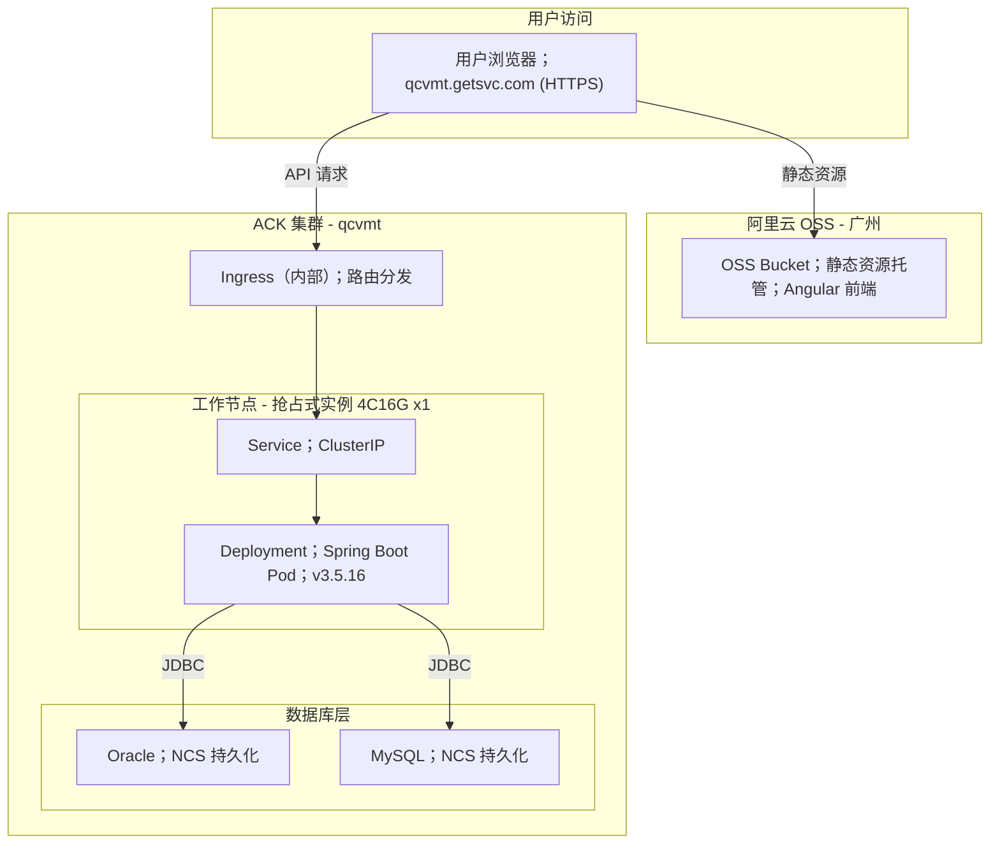
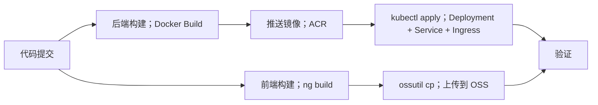

`根据补充信息，更新 Release Note 如下：`

 

# QCVMT Release Note

| 项目         | 内容                                     |
| ---------- | -------------------------------------- |
| 项目名称       | QCVMT                                  |
| 版本号        | v1.0.0                                 |
| 发布日期       | 2026-08-12                             |
| 部署目标       | 后端 → 阿里云 ACK（托管集群基础版）；前端 → 阿里云 OSS（广州） |
| CI/CD      | 阿里云云效（Flow）                            |

## 部署架构



## 部署步骤

### 一、前置准备

| 步骤         | 操作                          | 说明                                            |
| ---------- | --------------------------- | --------------------------------------------- |
| 1          | 确认 ACK 集群 `qcvmt` 状态正常      | 控制台 → 容器服务 → 集群列表，确认集群状态为"运行中"                |
| 2          | 确认抢占式实例节点就绪                 | `kubectl get nodes` 确认 1 个 4C16G 节点 Ready     |
| 3          | 安装 Nginx Ingress Controller | ACK 集群中安装 Ingress Controller（用于内部 Ingress 路由） |
| 4          | 确认 OSS Bucket 已创建           | Bucket 区域：广州，开启静态网站托管，配置 HTTPS                |
| 5          | 确认域名解析                      | `qcvmt.getsvc.com` 解析到 OSS 和 Ingress 对应地址     |
| 6          | 确认 NCS 持久化存储卷已创建            | Oracle 和 MySQL 数据持久化均依赖 NCS 存储                |

### 二、后端部署（ACK）

### 2.1 构建并推送镜像

```bash
# 在云效 Flow 流水线中配置，或本地执行：
docker build -t registry.cn-guangzhou.aliyuncs.com/qcvmt/backend:v1.0.0 .
docker push registry.cn-guangzhou.aliyuncs.com/qcvmt/backend:v1.0.0
```

### 2.2 部署 Oracle 数据库

`kubectl create namespace qcvmt-db`\
`kubectl apply -f oracle-pvc.yaml -n qcvmt-db`\
`kubectl apply -f oracle-deployment.yaml -n qcvmt-db`\
`kubectl apply -f oracle-service.yaml -n qcvmt-db`\
`kubectl get pods -n qcvmt-db`

### 2.3 部署 MySQL 数据库

`kubectl apply -f mysql-pvc.yaml -n qcvmt-db`\
`kubectl apply -f mysql-deployment.yaml -n qcvmt-db`\
`kubectl apply -f mysql-service.yaml -n qcvmt-db`\
`kubectl get pods -n qcvmt-db`

### 2.4 部署 Spring Boot 后端（Deployment + Service + Ingress）

```bash
cvmt-app
kubectl apply -f db-secret.yaml -n qcvmt-app
kubectl apply -f backend-deployment.yaml -n qcvmt-app
kubectl apply -f backend-service.yaml -n qcvmt-app
kubectl apply -f backend-ingress.yaml -n qcvmt-app
kubectl get all,ingress -n qcvmt-app
```

### 2.5 YAML 配置文件参考

**backend-deployment.yaml**

```yaml
apiVersion: apps/v1
kind: Deployment
metadata:
  name: qcvmt-backend
  namespace: qcvmt-app
  labels:
    app: qcvmt-backend
spec:
  replicas: 1
 selector:
   matchLabels:
      app: qcvmt-backend
  template:
    metadata:
      labels:
        app: qcvmt-backend
    spec:
      containers:
      - name: qcvmt-backend
          image: registry.cn-guangzhou.aliyuncs.com/qcvmt/backend:v1.0.0
          imagePullPolicy: IfNotPresent
          ports:
            - containerPort: 8080
          env:
            - name: SPRING_PROFILES_ACTIVE
             value: "prod"
            - name: ORACLE_URL
              value: "jdbc:oracle:thin:@oracle-service.qcvmt-db.svc.cluster.local:1521:ORCL"
          - name: ORACLE_USERNAME
             valueFrom:
                secretKeyRef:
                 name: db-secret
                  key: oracle-username
            - name: ORACLE_PASSWORD
              valueFrom:
               secretKeyRef:
                  name: db-secret
                 key: oracle-password
            - name: MYSQL_URL
              value: "jdbc:mysql://mysql-service.qcvmt-db.svc.cluster.local:306/qcvmt?useSSL=false&characterEncoding=utf8"
            - name: MYSQL_USERNAME
              valueFrom:
                secretKeyRef:
                 name: db-secret
                  key: mysql-username
            - name: MYSQL_PASSWORD
             valueFrom:
                secretKeyRef:
                  name: db-secret
                  key: mysql-password
          resources:
            requests:
              cpu: "50m"
              memory: "1Gi"
            limits:
              cpu: "200m"
              memory: "4Gi"
          livenessProbe:
           httpGet:
              path: /actuator/health/liveness
              port: 80
           initialDelaySeconds: 60
            periodSeconds: 15
          readinessProbe:
            httpGet:
             path: /actuator/health/readiness
              port: 80
           30
            periodSeconds: 10
```

**backend-service.yaml**

```yaml
apiVersion: v1
kind: Service
metadata:
  name: qcvmt-backend-svc
  namespace: qcvmt-app
spec:
  type: ClusterIP
  selector:
    app: qcvmt-backend
  ports:
    - port: 80
      targetPort: 80
     protocol: TCP
```

**

```yaml
apiVersion: networking.k8s.io/v1
kind: Ingress
metadata:
 name: qcvmt-backend-ingress
  namespace: qcvmt-app
  annotations:
    nginx.ingress.kubernetes.io/rewrite-target: /
    nginx.ingress.kubernetes.io/ssl-redirect: "true"
   nginx.ingress.kubernetes.io/proxy-body-size: "50m"
    nginx.ingress.kubernetes.io/proxy-read-timeout: "120"
spec:
  ingressClassName: nginx
  rules:
    - host: qcvmt.getsvc.com
      http:
        paths:
          - path: /api
            pathType: Prefix
            backend:
              service:
                name: qcvmt-backend-svc
                port:
                  number: 80
```

**db-secret.yaml**

```yaml
apiVersion: v1
kind: Secret
metadata:
  name: db-secret
  namespace: qcvmt-app
type: Opaque
stringData:
  oracle-username: "<oracle_user>"
  oracle-password: "<oracle_password>"
 mysql-username: "<mysql_user>"
  mysql-password: "<mysql_password>"
```

`oracle-pvc.yaml / mysql-pvc.yaml（NCS 持久化参考）`

```yaml
apiVersion: v1
kind: PersistentVolumeClaim
metadata:
  name: oracle-data-pvc
 namespace: qcvmt-db
spec:
  accessModes:
    - ReadWriteOnce
 storageClassName: alicloud-disk-ncs
 resources:
   requests:
     storage: 50Gi

---

apiVersion: v1
kind: Persistent:
  name: mysql-data-pvc
  namespace: qcvmt-db
spec:
  accessModes:
    - ReadWriteOnce
  storageClassName: alicloud-disk-ncs
  resources:
    requests:
      storage: 20Gi
```

### 三、前端部署（OSS）

### 3.1 构建 Angular 前端

```bash
npm install
ng build --configuration production --base-href /
```

### 3.2 上传至 OSS

```bash
ossutil cp -r dist/ oss://<bucket-name>/ --update
```

### 3.3 OSS 配置清单

| 配置项        | 值                                                        |
| ---------- | -------------------------------------------------------- |
| Bucket 区域  | 广州（cn-guangzhou）                                         |
| 静态网站托管     | 开启，默认首页 `index.html`，404 页面 `index.html`（Angular SPA 路由） |
| 访问权限       | 公共读                                                      |
| HTTPS      | 开启，绑定 SSL 证书（`qcvmt.getsvc.com`）                         |
| CDN        | 不启用                                                      |
| CORS       | 允许 `qcvmt.getsvc.com` 跨域访问后端 API                         |

### 3.4 域名与证书

```bash
# 1. 在阿里云 SSL 证书服务中申请/上传 qcvmt.getsvc.com 证书
# 2. 在 OSS Bucket 自定义域名中绑定 qcvmt.getsvc.com 并关联证书
# 3. DNS 解析配置：
#    qcvmt.getsvc.com → CNAME → <oss-bucket>.oss-cn-guangzhou.aliyuncs.com
#    api.qcvmt.getsvc.com → A → Ingress Controller 外部 IP（如 API 走独立子域名）
```

### 四、云效 Flow 流水线配置



| 阶段         | 触发条件          | 操作                                              |
| ---------- | ------------- | ----------------------------------------------- |
| 后端构建       | 代码推送至 main 分支 | Docker build + push 至 ACR                       |
| 后端部署       | 镜像推送成功        | kubectl apply 更新 Deployment / Service / Ingress |
| 前端构建       | 代码推送至 main 分支 | npm install + ng build                          |
| 前端部署       | 构建成功          | ossutil 上传 dist/ 至 OSS                          |
| 验证         | 全部署完成         | 健康检查 + 页面访问验证                                   |

### 五、部署后验证

| 验证项        | 方法                                                  | 预期结果                      |
| ---------- | --------------------------------------------------- | ------------------------- |
| 后端 Pod 状态  | `kubectl get pods -n qcvmt-app`                     | 所有 Pod 为 Running          |
| Ingress 路由 | `kubectl get ingress -n qcvmt-app`                  | 显示 ADDRESS 和规则            |
| 后端健康检查     | `curl https://qcvmt.getsvc.com/api/actuator/health` | 返回 `{"status":"UP"}`      |
| Oracle 连接  | 后端日志                                                | 无 `Connection refused` 错误 |
| MySQL 连接   | 后端日志                                                | 无 `Connection refused` 错误 |
| 前端页面       | 浏览器访问 `https://qcvmt.getsvc.com`                    | 正常加载 Angular 应用           |
| SPA 路由     | 刷新任意子路由页面                                           | 不出现 404                   |
| HTTPS 证书   | 浏览器地址栏                                              | 显示安全锁标识                   |
| NCS 持久化    | 重启 Oracle/MySQL Pod 后检查数据                           | 数据未丢失                     |

### 六、回滚方案

| 场景          | 回滚操作                                                         |
| ----------- | ------------------------------------------------------------ |
| 后端异常        | `kubectl rollout undo deployment/qcvmt-backend -n qcvmt-app` |
| 前端异常        | `ossutil cp -r dist-backup/ oss://<bucket>/` 重新上传上一版本        |
| Oracle 数据异常 | 从 NCS 快照恢复持久卷                                                |
| MySQL 数据异常  | 从 NCS 快照恢复持久卷                                                |
| 整体回滚        | 先回滚前端 → 再回滚后端 → 检查双数据库状态                                     |

### 七、注意事项

- 抢占式实例可能被回收，需配置中断通知并准备手动恢复流程
- 单节点集群无高可用，生产环境建议升级为多节点
- Oracle + MySQL 双数据源需在 Spring Boot `application-prod.yml` 中正确配置多数据源（Multi-DataSource）
- Ingress（内部）仅集群内可达，如需外部访问 API 需配置外部 Ingress 或通过 OSS 代理转发
- Oracle 和 MySQL 均部署在 ACK 内为单点，建议定期通过 NCS 快照做数据备份
- 4C16G 单节点同时运行 Spring Boot + Oracle + MySQL，需关注资源争抢，建议为数据库 Pod 设置合理的 resources limits